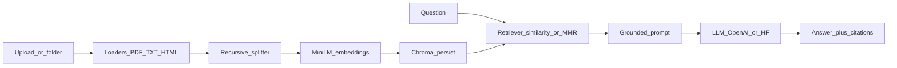

# RAG-Powered Document Q&A System

Upload a document, ask a question in plain English, and get an answer that stays inside that document. The system is a retrieval-augmented generation pipeline: loaders and a text splitter, a persistent vector database, and an LLM, orchestrated with LangChain.

RAG is the dominant pattern for production LLM applications in 2025–2026. A full pipeline shows how embeddings, chunking, and retrieval quality fit together, and how generation is deployed on top of a store rather than trained from scratch. LangChain, vector databases, and LLM orchestration now show up together in ML engineering roles. This repo is one project that uses all three, on the kinds of files people actually ask questions about: research papers, company reports, books, and legislation.

## The problem

A raw LLM will answer from memory. On a 10-Q, a paper, or a statute, that produces fluent text that may not be in the file. The useful system has to:

- Accept mixed files. Project Gutenberg is plain text. SEC EDGAR filings are HTML. arXiv papers, company reports, and legislation are PDFs.
- Cut long documents into chunks that still carry a source and a page.
- Search those chunks by meaning, not by keyword alone.
- Hand only the retrieved text to the model, and show where the answer came from.
- Let chunk size, overlap, and the number of chunks change without mixing old vectors into the new index.

## How it was solved

The pipeline is split so retrieval can be tuned without rewriting the model call.

1. **Ingest.** [`src/rag/ingest.py`](src/rag/ingest.py) loads PDF, TXT, Markdown, and HTML. Each chunk keeps `source`, `doc_type`, `page`, and `chunk_id`.
2. **Index.** [`src/rag/store.py`](src/rag/store.py) embeds chunks with `sentence-transformers/all-MiniLM-L6-v2` and stores them in persistent Chroma. The collection name includes chunk size and overlap, so a new splitter setting does not reuse old vectors.
3. **Retrieve.** The same module searches with maximum marginal relevance (diverse chunks) or plain similarity, optionally limited to one file.
4. **Answer.** [`src/rag/chain.py`](src/rag/chain.py) puts only those chunks in the prompt. If they do not contain the answer, the model is told to say so. The reply ends with the file and page.
5. **Use.** [`app.py`](app.py) is a Streamlit app: upload or index a folder, ask a question, read the cited chunks, and move the retrieval knobs.
6. **Check.** [`scripts/eval_retrieval.py`](scripts/eval_retrieval.py) asks three questions against the bundled samples and fails if the expected fact is missing from the top chunks.



| Piece | Where it lives |
| --- | --- |
| LangChain loaders, splitter, prompt, and chain | [`src/rag/ingest.py`](src/rag/ingest.py), [`src/rag/chain.py`](src/rag/chain.py) |
| Vector database | [`src/rag/store.py`](src/rag/store.py) |
| LLM provider switch and grounded answers | [`src/rag/chain.py`](src/rag/chain.py) |
| Retrieval knobs and a repeatable check | [`app.py`](app.py), [`scripts/eval_retrieval.py`](scripts/eval_retrieval.py) |

What went wrong while building this, and how each issue was fixed, is in [`journal.md`](journal.md).

## Setup

Python 3.14 is what this machine used. A 3.11 or 3.12 environment is fine if that is what you have.

```bash
python3 -m venv .venv
source .venv/bin/activate
pip install -r requirements.txt
cp .env.example .env
```

Set `OPENAI_API_KEY` in `.env` for `gpt-4o-mini`. Leave the key empty and the app uses the local Hugging Face model named in `LOCAL_MODEL`. Embeddings stay local either way, so indexing does not need an API key.

## Run

```bash
source .venv/bin/activate
streamlit run app.py
```

Index the bundled samples from the sidebar, or upload your own PDF, TXT, Markdown, or HTML. Ask a question. The answer and the chunks it used appear together.

Check retrieval without calling the LLM:

```bash
python scripts/eval_retrieval.py
```

## Corpora

The app does not crawl the web. Drop files into `data/raw/` or upload them. These public sources match the loaders:

- **Project Gutenberg** (plain text): [Frankenstein](https://www.gutenberg.org/cache/epub/84/pg84.txt)
- **SEC EDGAR** (HTML filings): [company search](https://www.sec.gov/edgar/search/). Save the filing document as `.html`.
- **arXiv** (PDF): a paper PDF such as [https://arxiv.org/pdf/1706.03762](https://arxiv.org/pdf/1706.03762)

`samples/` has three short stand-ins so the retrieval check runs with no download: a quarterly report, an HTML filing excerpt, and a paper-style note.

## Retrieval defaults

| Knob | Default | Why |
| --- | --- | --- |
| Chunk size | 1000 characters | Long enough for a paragraph, short enough to point at a page |
| Overlap | 200 characters | A sentence cut by the splitter still appears in the next chunk |
| Top k | 4 | Enough context for a short answer without flooding the prompt |
| Search | MMR | Pulls chunks that are relevant and not copies of each other |

Switch search to similarity when you want the nearest chunks only. A score threshold above 0 drops weak similarity hits. Changing chunk size or overlap selects a different Chroma collection. Re-index after that change.

## Layout

```
app.py                      Streamlit upload, chat, citations, knobs
src/rag/config.py           Chunking, retrieval, and provider settings
src/rag/ingest.py           PDF, text, and HTML loaders
src/rag/store.py            Chroma index and retriever
src/rag/chain.py            Grounded prompt and LLM call
scripts/eval_retrieval.py   Retrieval check against samples/
samples/                    Small report, filing, and paper
journal.md                  Issues hit during the build
```
