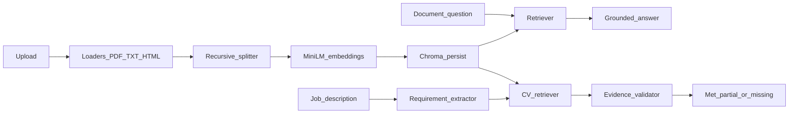

# RAG-Powered Document Q&A System

The app has two separate pages. **Document Q&A** uploads a paper, filing, report, or book and answers from the retrieved passages. **CV & Job Match** reads a CV against a job description, marks each requirement met, partial, or missing, and will not turn a related line into a skill the CV does not name. Under both pages is a retrieval-augmented generation pipeline: loaders and a text splitter, a persistent vector database, and an LLM, orchestrated with LangChain.

RAG is the dominant pattern for production LLM applications in 2025–2026. A full pipeline shows how embeddings, chunking, and retrieval quality fit together, and how generation is deployed on top of a store rather than trained from scratch. LangChain, vector databases, and LLM orchestration now show up together in ML engineering roles. This repo is one project that uses all three, on a CV and on the other files people ask questions about: research papers, company reports, books, and legislation.

## The problem

A raw LLM will answer from memory. On a 10-Q, a paper, or a statute, that produces fluent text that may not be in the file. The useful system has to:

- Accept mixed files. Project Gutenberg is plain text. SEC EDGAR filings are HTML. arXiv papers, company reports, and legislation are PDFs.
- Cut long documents into chunks that still carry a source and a page.
- Search those chunks by meaning, not by keyword alone.
- Hand only the retrieved text to the model, and show where the answer came from.
- Let chunk size, overlap, and the number of chunks change without mixing old vectors into the new index.

## How it was solved

The pipeline is split so retrieval can be tuned without rewriting the model call.

1. **Ingest.** [`src/rag/ingest.py`](src/rag/ingest.py) loads PDF, TXT, Markdown, and HTML. Each chunk keeps `source`, `doc_type`, `page`, and `chunk_id`.
2. **Index.** [`src/rag/store.py`](src/rag/store.py) embeds chunks with `sentence-transformers/all-MiniLM-L6-v2` and stores them in persistent Chroma. The collection name includes chunk size and overlap, so a new splitter setting does not reuse old vectors.
3. **Retrieve.** The same module searches with maximum marginal relevance (diverse chunks) or plain similarity, optionally limited to one file.
4. **Answer.** [`src/rag/chain.py`](src/rag/chain.py) puts only the retrieved chunks in a normal question. If they do not contain the answer, the model is told to say so.
5. **Document Q&A.** [`frontend/views/document_qa.py`](frontend/views/document_qa.py) asks questions over the index. A question about the whole file can read every chunk of that file. This page does not score a CV.
6. **CV & Job Match.** [`backend/services/`](backend/services/) extracts requirements, retrieves CV chunks for each one, and [`evidence_validator.py`](backend/services/evidence_validator.py) blocks unsupported claims. A CV line about REST APIs can be a partial match for FastAPI. The suggestion tells the candidate to add FastAPI only if they have used it, and to keep the REST API line otherwise.
7. **Use.** [`frontend/streamlit_app.py`](frontend/streamlit_app.py) opens the two pages separately. Retrieval knobs stay in the sidebar of each page.
8. **Check.** [`scripts/eval_retrieval.py`](scripts/eval_retrieval.py) asks three questions against the bundled samples. [`evaluation/benchmark.py`](evaluation/benchmark.py) checks that a CV quote used in a match is actually in the CV, and that a partial skill is not claimed as present.



| Piece | Where it lives |
| --- | --- |
| LangChain loaders, splitter, prompt, and chain | [`src/rag/ingest.py`](src/rag/ingest.py), [`src/rag/chain.py`](src/rag/chain.py) |
| Vector database | [`src/rag/store.py`](src/rag/store.py) |
| Document Q&A page | [`frontend/views/document_qa.py`](frontend/views/document_qa.py) |
| Requirement match and evidence check | [`backend/services/`](backend/services/) |
| Retrieval knobs and checks | [`app.py`](app.py), [`scripts/eval_retrieval.py`](scripts/eval_retrieval.py), [`evaluation/benchmark.py`](evaluation/benchmark.py) |

## A fault found in use

Uploading a file and asking what it contained returned exactly: "I cannot find that in the uploaded documents."

The file had been chosen in the browser, but it was not in the search index. The app was still searching the bundled sample report, filing, and paper. The prompt is required to refuse when those passages do not contain the answer, so every question about the new file got that sentence.

A second limit made whole-file questions fail even after a successful index. A normal question sends only the top 4 chunks. Asking what the file is, or how to improve it, needs the whole document.

The fix is in [`app.py`](app.py) and [`src/rag/chain.py`](src/rag/chain.py):

- Choosing a file indexes it immediately. The bundled samples stay out unless that option is turned on.
- **Describe this file** and **Improve this CV for the role** read every stored chunk of that file, not only the top 4.
- A PDF with no selectable text is reported as unreadable instead of being treated as an empty search.

The same fault, and the other issues from the build, are written up in [`journal.md`](journal.md).

## Setup

Python 3.14 is what this machine used. A 3.11 or 3.12 environment is fine if that is what you have.

```bash
python3 -m venv .venv
source .venv/bin/activate
pip install -r requirements.txt
cp .env.example .env
```

Set `OPENAI_API_KEY` in `.env` for `gpt-4o-mini`. Leave the key empty and the app uses the local Hugging Face model named in `LOCAL_MODEL`. Embeddings stay local either way, so indexing does not need an API key.

## Run

```bash
source .venv/bin/activate
streamlit run app.py
```

**Document Q&A** indexes a PDF, TXT, Markdown, or HTML file when you select it, then answers from the retrieved passages. **CV & Job Match** takes a CV and a job description and lists each requirement with the CV line that supports it. A PDF with no selectable text is reported instead of being treated as an empty search.

The matching API, for callers other than the page:

```bash
uvicorn backend.main:app --reload
```

Check retrieval without calling the LLM:

```bash
python scripts/eval_retrieval.py
```

## Corpora

The app does not crawl the web. Drop files into `data/raw/` or upload them. These public sources match the loaders:

- **Project Gutenberg** (plain text): [Frankenstein](https://www.gutenberg.org/cache/epub/84/pg84.txt)
- **SEC EDGAR** (HTML filings): [company search](https://www.sec.gov/edgar/search/). Save the filing document as `.html`.
- **arXiv** (PDF): a paper PDF such as [https://arxiv.org/pdf/1706.03762](https://arxiv.org/pdf/1706.03762)

`samples/` has three short stand-ins so the retrieval check runs with no download: a quarterly report, an HTML filing excerpt, and a paper-style note.

## Retrieval defaults

| Knob | Default | Why |
| --- | --- | --- |
| Chunk size | 1000 characters | Long enough for a paragraph, short enough to point at a page |
| Overlap | 200 characters | A sentence cut by the splitter still appears in the next chunk |
| Top k | 4 | Enough context for a short answer without flooding the prompt |
| Search | MMR | Pulls chunks that are relevant and not copies of each other |

Switch search to similarity when you want the nearest chunks only. A score threshold above 0 drops weak similarity hits. Changing chunk size or overlap selects a different Chroma collection. Re-index after that change.

## Layout

```
app.py                              Streamlit entry for the two pages
frontend/streamlit_app.py           Same entry, under frontend/
frontend/views/document_qa.py       Upload, questions, citations
frontend/views/cv_job_match.py      Requirement match against a CV
backend/main.py                     FastAPI app for CV matching
backend/services/                   Parser, retriever, matcher, evidence check
src/rag/                            Shared loaders, Chroma index, grounded answers
evaluation/benchmark.py             Checks quotes and unsupported skill claims
scripts/eval_retrieval.py           Retrieval check against samples/
samples/                            Small report, filing, and paper
journal.md                          Issues hit during the build
```
